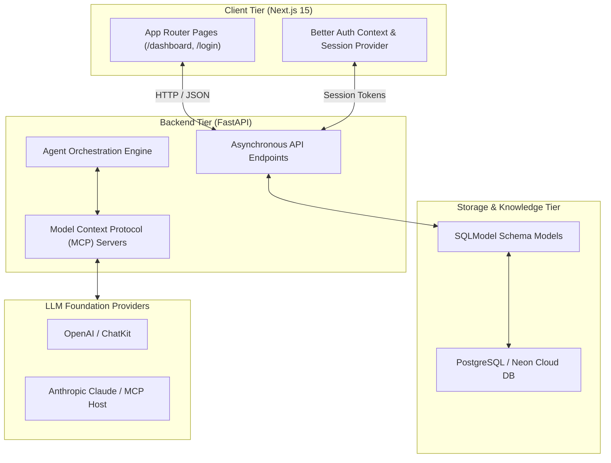

# Agent Factory — Autonomous AI Systems & Full-Stack Engineering Platform

> **Comprehensive laboratory, reference implementation, and engineering suite for autonomous agent design, Model Context Protocol (MCP) servers, FastAPI asynchronous backends, SQLModel data pipelines, and Next.js 15 auth portals.**

---

> **Created & Maintained by [Abdullah Qureshi](https://abdullah-qureshi.vercel.app)**  
> 🌐 **Portfolio**: [abdullah-qureshi.vercel.app](https://abdullah-qureshi.vercel.app) • 💼 **LinkedIn**: [abdullahqureshi27](https://www.linkedin.com/in/abdullahqureshi27) • 🐙 **GitHub**: [@abdullahqureshi27](https://github.com/abdullahqureshi27)

---

[](https://fastapi.tiangolo.com/)
[](https://nextjs.org/)
[](https://python.org)
[](https://www.typescriptlang.org/)
[](https://modelcontextprotocol.io/)
[](https://github.com/abdullahqureshi27/learning-developement-using-agent-factory)

---

## 🌟 Key Architecture Modules

- 🤖 **MCP (Model Context Protocol) Server Suite**: Custom-engineered MCP servers providing external tool definitions, stateful resources, and sandboxed prompt executions to Claude and OpenAI agent clients.
- ⚡ **Asynchronous FastAPI Engines**: High-performance RESTful APIs built with `asyncpg`, dependency injection, background worker tasks, and OpenAPI schemas.
- 🗄️ **Relational Data Modeling with SQLModel**: Asynchronous database access and migration patterns across PostgreSQL with Neon serverless connectivity.
- 🔐 **Next.js 15 & Better Auth Dashboard**: End-to-end full-stack authentication portal featuring JWT sessions, JWKS verification, and responsive dashboards.
- 🧠 **Agent SDK CLI Framework**: Modular agentic command-line interface demonstrating structured JSON tool-use, loop control, and reasoning boundaries.

---

## 🏗️ System Architecture



---

## 🛠️ Technology Stack

| Domain | Technology / Library | Purpose |
|---|---|---|
| **Backend API** | [FastAPI](https://fastapi.tiangolo.com/) | High-performance asynchronous microservices |
| **Frontend UI** | [Next.js 15](https://nextjs.org/) + [React 19](https://react.dev/) | Client portals, RSC, and state management |
| **Protocols** | [Model Context Protocol (MCP)](https://modelcontextprotocol.io/) | Context and tool interfaces for LLMs |
| **ORM & Database** | [SQLModel](https://sqlmodel.tiangolo.com/) + [PostgreSQL](https://www.postgresql.org/) | Type-safe asynchronous schema validation |
| **Authentication** | [Better Auth](https://www.better-auth.com/) | Secure cookie, session, and JWT management |
| **Languages** | Python 3.12+ & TypeScript 5 | End-to-end type safety |

---

## 📂 Repository Directory Layout

```text
learning-developement-using-agent-factory/
├── mcp_servers/              # Custom Model Context Protocol (MCP) server implementations
├── fastapi/                  # Asynchronous FastAPI microservices and routers
├── frontend/                 # Next.js 15 Better Auth client dashboard
├── PostgreSQL/               # Database migration scripts and schema definitions
├── sqlmodel-learning/        # SQLModel relationships, query optimizations, and tests
├── projects/                 # Concrete autonomous agent applications & CLI tools
├── chatkit_openai/           # ChatKit and streaming LLM integration interfaces
├── student-management-system/# Full-stack educational management service
└── LEARNING_ROADMAP.md       # Comprehensive syllabus and design curriculum
```

---

## 🚀 Local Quickstart Guide

### Prerequisites
- Python 3.12+ and [uv](https://docs.astral.sh/uv/) (or virtualenv)
- Node.js 18+ and npm

### 1. Clone Repository
```bash
git clone https://github.com/abdullahqureshi27/learning-developement-using-agent-factory.git
cd learning-developement-using-agent-factory
```

### 2. Run Backend Services
```bash
cd fastapi
python -m venv .venv
# On Windows:
.venv\Scripts\activate
pip install -r requirements.txt
uvicorn main:app --reload --port 8000
```

### 3. Run Frontend Portal
```bash
cd ../frontend
npm install
npm run dev
```
Open [http://localhost:3000](http://localhost:3000) for the UI and [http://localhost:8000/docs](http://localhost:8000/docs) for the interactive Swagger documentation.

---

## 🧪 Verification & Testing

```bash
# Verify Python syntax across core agent modules
python -m py_compile agent_copy.py

# Typecheck and build the Next.js frontend
cd frontend
npm run build
```

---

## 👨‍💻 Author & Connect

**Abdullah Qureshi**  
*Full-Stack & AI Systems Engineer*

- 🌐 **Portfolio**: [https://abdullah-qureshi.vercel.app](https://abdullah-qureshi.vercel.app)
- 💼 **LinkedIn**: [https://www.linkedin.com/in/abdullahqureshi27](https://www.linkedin.com/in/abdullahqureshi27)
- 🐙 **GitHub**: [https://github.com/abdullahqureshi27](https://github.com/abdullahqureshi27)
- ✉️ **Contact**: [mabdullahqureshi583@gmail.com](mailto:mabdullahqureshi583@gmail.com)
